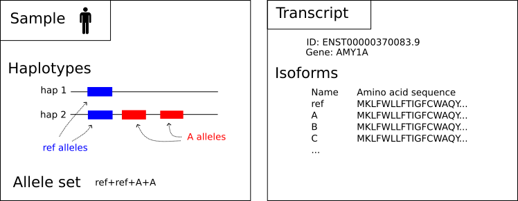
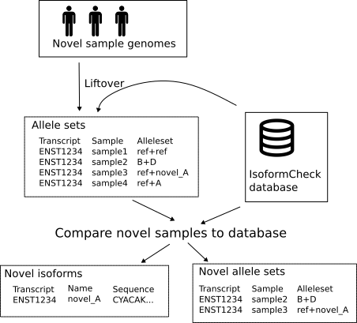

## IsoformCheck

Protein isoform analysis from de novo genome assemblies.

### Overview

IsoformCheck takes in haplotype phased assemblies and calls protein isoforms based on the sample sequence.
Reference transcript annotations are lifted over to samples with [liftoff](https://github.com/agshumate/Liftoff).
The coding sequences of the lifted over annotations are used to call amino acid sequences of the transcripts.
The isoforms can then be compared between samples to find novel sequences and copy count variation.

### Glossary

- Sample: a genome assembly consisting of two haplotypes of a single individual.
- Haplotype: a set of chromosomes with a single copy of each homologous chromosome. That is, one copy of chr1, one copy of chr2, ...etc... , one copy of either chrX or chrY.
- Transcript: a reference transcript, ie. a splice variant of a gene. Only protein coding genes are used.
- Isoform: a distinct amino acid sequence of a transcript.
- Allele: a single instance of an isoform in a sample.
- Allele set: all alleles of a single sample for a single transcript.
- Group: an arbitrary group of samples used for creating contingency tables and running chi squared tests.

### Detecting novel isoforms and allele sets

IsoformCheck can be used to detect novel isoforms and allele sets in samples.
This requires haplotype phased assemblies of the novel samples, and compares the protein coding transcripts present in the novel samples with existing samples in an IsoformCheck database.
To do this, you first need a pre-existing database of haplotype phased samples (see [prebuilt databases](#prebuilt-isoformcheck-databases-of-long-read-samples)).
Then use the `comparesamples` command of IsoformCheck.

The output will have three tables:
- `output_allelesets.tsv`: All allele sets of the given novel samples.
- `output_novel_isoforms.tsv`: Isoforms which are novel to the samples and not previously present in the database.
- `output_novel_allelesets.tsv`: Allele sets which are novel to the samples and not previously present in the database.

The command `comparesamples` requires a table of samples.
The format of the table is a table separated file.
Each row is a single haplotype, so each sample will have two rows.
There are three (optionally four) columns:
- `Sample`: Name of sample.
- `Haplotype`: Sample haplotype in this row. Must be one of 1, 2, mat or pat.
- `Assembly`: Path to a fasta/fastq file of this haplotype.
- `Annotation`: This is optional and the column can be left out, and if present can be left blank for any row. Path to a lifted over annotation file for this haplotype. If this is present, then the given file is used as the annotation, otherwise IsoformCheck will run liftover for the haplotype.

If you are running a large number of samples, it's faster to first run the `liftover` command separately for each haplotype and then include the lifted over annotation files in the sample table.
This lets you run the liftover in parallel.
Comparing samples will not store the novel samples in the database.
If you want to keep the samples present in the database, see [adding samples to an existing database](#adding-samples-to-an-existing-database).

### Contingency tables and chi squared tests

You can export contingency tables and run chi squared tests of the samples present in the database.
The samples must first be present in the database (see [adding samples](#adding-samples-to-an-existing-database)).
Then the samples must be added to groups.
You can either use the `addgroup` command which stores the groups in the database, or define the groups in a file which will not store the groups in the database.
The group file format is a tab separated file with two columns:
- `Sample`: name of sample
- `Group`: name of group

Then the command `contingencytable` can be used to generate contingency tables either for a single transcript or all transcripts, and `chisquare` can be used to run chi squared tests either for a single transcript or all transcripts.

### Prebuilt IsoformCheck databases of long read samples

A database of 231 samples from the [Human Pangenome Reference Consortium](https://humanpangenome.org/) and 61 samples from the [Human Genome Structural Variation Consortium](https://www.hgsvc.org/).

### Building your own database

Run the `initialize` command with a reference genome and reference annotation.
This filters the annotation into only transcripts which have coding sequences defined and creates an IsoformCheck database folder.
After this [add your samples to the database](#adding-samples-to-an-existing-database).

### Adding samples to an existing database

Run `liftover` for all of your sample haplotypes.
Then add the samples with `addsamples`.
`addsamples` requires a table of samples, whose format is the same as the sample table in the section [Detecting novel isoforms and allele sets](#detecting-novel-isoforms-and-allele-sets).
Finally, after all samples have been added, run `rename` to give names to all isoforms.
After this the database is ready.

### Commands

- `initialize`: Create a new IsoformCheck database. Requires a reference genome and reference annotation.
- `liftover`: Lift over annotations to a single haplotype. Can be used to parallelize the sample adding step. Use this instead of calling liftoff directly to ensure that the same parameters and same reference annotation are used.
- `addsample`: Adds a single haplotype to an IsoformCheck database.
- `addsamples`: Adds multiple samples to an IsoformCheck database.
- `listsamples`: List all samples in the database.
- `addgroup`: Add a sample into a group.
- `removegroup`: Remove a sample from a group.
- `listgroups:` List all groups.
- `rename`: Renames isoforms based on their coverages. Must be called after all samples have been added and before doing any analysis.
- `comparesamples`: Compares new samples to existing samples.
- `exportisoforms`: Export isoform names, sequences, and copy counts.
- `exportallelesets`: Export allele sets.
- `contingencytable`: Export contingency tables of allele sets by group.
- `chisquare`: Run chi squares tests to check which transcripts vary between groups.
- `stats`: Basic statistics about the database.
- `validate`: Check database validity.
